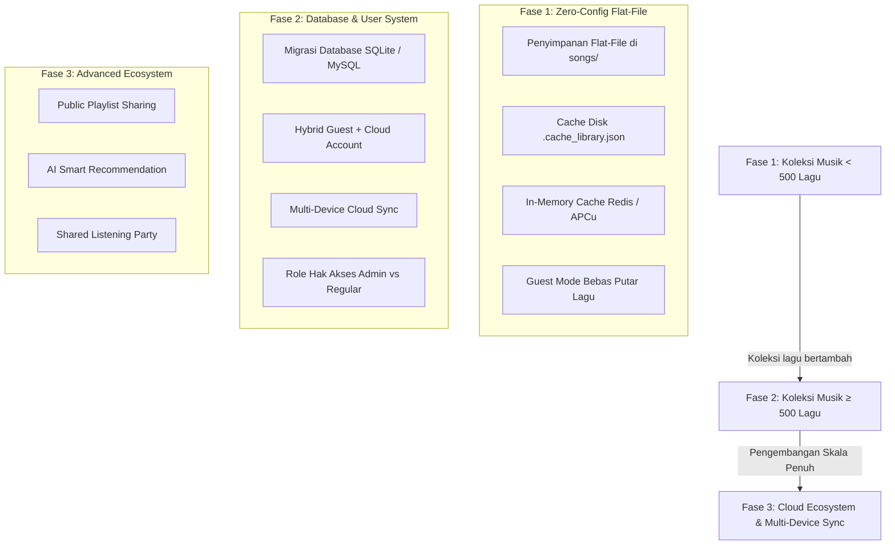

# 🗺️ Roadmap & Rencana Pembaruan — NadaKita

Dokumen ini berisi peta jalan pengembangan, rencana peningkatan performa, dan arsitektur database masa depan untuk **NadaKita Music Player**.

---

## 📌 Ringkasan Fase Pengembangan



---

## 🚀 Rincian Fase & Milestone

### 🟢 Fase 1: Flat-File & In-Memory Cache (Status: Aktif / Koleksi < 500 Lagu)
Fase ini berfokus pada **kecepatan maksimal, kemudahan pemeliharaan, dan zero-configuration**:
* [x] **Zero-Config Storage:** Musik disimpan langsung di folder `/songs/`, otomatis terdeteksi tanpa perlu setup database.
* [x] **Smart Metadata Extraction:** Ekstraksi ID3 otomatis dengan pembersihan judul cerdas (*Smart Title Sanitization*) dan normalisasi unicode dash.
* [x] **Multi-Tier Caching:**
  - Tier 1: In-Memory Cache (**Redis / APCu**) untuk response instan.
  - Tier 2: Disk Cache (`.cache_library.json`) terkompresi dengan validasi ETag.
* [x] **Guest Mode 100%:** Siapa pun bisa memutar lagu, mengatur equalizer, lirik sync, dan membuat playlist lokal via `localStorage` / `IndexedDB` tanpa harus login.
* [x] **Pembersih Duplikat:** Pemindaian cerdas file musik ganda dengan penghapusan aman dari server.
* [x] **NadaKita Wrapped:** Ekspor infografis statistik musik ke format gambar/story canvas.

---

### 🟡 Fase 2: Integrasi Database & Sistem Akun Hybrid (Target: Koleksi ≥ 500 Lagu)
Ketika koleksi lagu bertambah mencapai **500+ lagu**, arsitektur database akan diaktifkan untuk skalabilitas jangka panjang:

#### 1. Konsep Pemutar Musik (Mirip Spotify / YouTube Music)
* **Tetap Bisa Putar Lagu Tanpa Login (Guest Mode):**
  - Pengunjung tetap bisa langsung memutar semua lagu di server tanpa dipaksa login.
  - Fitur dasar seperti antrean (*Queue*), volume, dan lirik sinkron tetap gratis dan bebas digunakan.
* **Opsi Login Akun (User Account Mode):**
  - Pengguna yang ingin menyinkronkan lagu antar perangkat (Laptop, HP, Tablet) dapat membuat akun.
  - Fitur migrasi otomatis: Saat pertama kali registrasi, muncul pop-up *"Ingin menyinkronkan playlist & favorit lokal Anda ke akun baru?"* sehingga data lokal otomatis ter-upload ke cloud server.
* **Tingkatan Hak Akses (Role-Based Access Control):**
  - **Regular User:** Membuat playlist tersimpan di cloud, simpan favorit, riwayat putar personal.
  - **Admin:** Akses panel upload lagu, YouTube/Spotify batch downloader, scan server, dan pengedit metadata global.

#### 2. Pilihan Mesin Database
* **SQLite (`nadakita.sqlite`):** *Rekomendasi Utama* — Berbasis 1 file database tunggal di server, tanpa perlu menginstal atau menyalakan service MySQL terpisah, memiliki kecepatan query B-Tree instan dan zero-maintenance.
* **MySQL / MariaDB:** Opsi alternatif jika NadaKita ingin dihubungkan ke server database terdistribusi.

---

### 🔵 Fase 3: Fitur Ekosistem Lanjutan & Cloud Sync
* [ ] **Public Playlist Sharing:** Pembuatan tautan unik untuk membagikan playlist ke teman.
* [ ] **Audio Quality Selector:** Pilihan streaming bitrate dinamis (128kbps / 320kbps / Lossless FLAC) untuk menghemat kuota saat di jaringan seluler.
* [ ] **Smart Auto-Playlist Generator:** Pembuatan playlist otomatis berdasarkan genre, tempo (BPM), atau artis yang sering didengarkan.
* [ ] **Remote Audio Cast:** Kontrol pemutaran musik di PC dari browser HP melalui WebSockets.

---

## 🗄️ Rancangan Skema Database (Fase 2)

```sql
-- 1. Tabel Pengguna
CREATE TABLE users (
    id VARCHAR(36) PRIMARY KEY,
    username VARCHAR(50) UNIQUE NOT NULL,
    email VARCHAR(100) UNIQUE NOT NULL,
    password_hash VARCHAR(255) NOT NULL,
    role ENUM('admin', 'user') DEFAULT 'user',
    avatar_url VARCHAR(255) NULL,
    created_at TIMESTAMP DEFAULT CURRENT_TIMESTAMP
);

-- 2. Tabel Koleksi Lagu (Indexed Library)
CREATE TABLE tracks (
    id VARCHAR(36) PRIMARY KEY,
    title VARCHAR(255) NOT NULL,
    artist VARCHAR(255) NOT NULL,
    album VARCHAR(255) DEFAULT 'Single',
    genre VARCHAR(100) DEFAULT 'Other',
    year VARCHAR(10) NULL,
    duration INT DEFAULT 0,
    bitrate INT DEFAULT 320,
    file_path VARCHAR(500) NOT NULL,
    cover_path VARCHAR(500) NULL,
    lrc_path VARCHAR(500) NULL,
    file_size BIGINT DEFAULT 0,
    created_at TIMESTAMP DEFAULT CURRENT_TIMESTAMP,
    INDEX idx_artist_title (artist, title)
);

-- 3. Tabel Playlist
CREATE TABLE playlists (
    id VARCHAR(36) PRIMARY KEY,
    user_id VARCHAR(36) NOT NULL,
    name VARCHAR(100) NOT NULL,
    description TEXT NULL,
    is_public BOOLEAN DEFAULT FALSE,
    cover_url VARCHAR(255) NULL,
    created_at TIMESTAMP DEFAULT CURRENT_TIMESTAMP,
    FOREIGN KEY (user_id) REFERENCES users(id) ON DELETE CASCADE
);

-- 4. Tabel Relasi Lagu dalam Playlist
CREATE TABLE playlist_tracks (
    id INT AUTO_INCREMENT PRIMARY KEY,
    playlist_id VARCHAR(36) NOT NULL,
    track_id VARCHAR(36) NOT NULL,
    track_order INT NOT NULL,
    added_at TIMESTAMP DEFAULT CURRENT_TIMESTAMP,
    FOREIGN KEY (playlist_id) REFERENCES playlists(id) ON DELETE CASCADE,
    FOREIGN KEY (track_id) REFERENCES tracks(id) ON DELETE CASCADE
);

-- 5. Tabel Lagu Favorit Personal
CREATE TABLE user_favorites (
    user_id VARCHAR(36) NOT NULL,
    track_id VARCHAR(36) NOT NULL,
    created_at TIMESTAMP DEFAULT CURRENT_TIMESTAMP,
    PRIMARY KEY (user_id, track_id),
    FOREIGN KEY (user_id) REFERENCES users(id) ON DELETE CASCADE,
    FOREIGN KEY (track_id) REFERENCES tracks(id) ON DELETE CASCADE
);

-- 6. Tabel Riwayat Pemutaran & Statistik
CREATE TABLE play_history (
    id BIGINT AUTO_INCREMENT PRIMARY KEY,
    user_id VARCHAR(36) NULL, -- Nullable untuk tracking anonim / guest
    track_id VARCHAR(36) NOT NULL,
    played_duration INT DEFAULT 0,
    played_at TIMESTAMP DEFAULT CURRENT_TIMESTAMP,
    FOREIGN KEY (track_id) REFERENCES tracks(id) ON DELETE CASCADE
);
```

---

*Dokumen ini akan terus diperbarui seiring perkembangan fitur NadaKita.*
